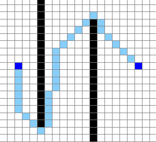
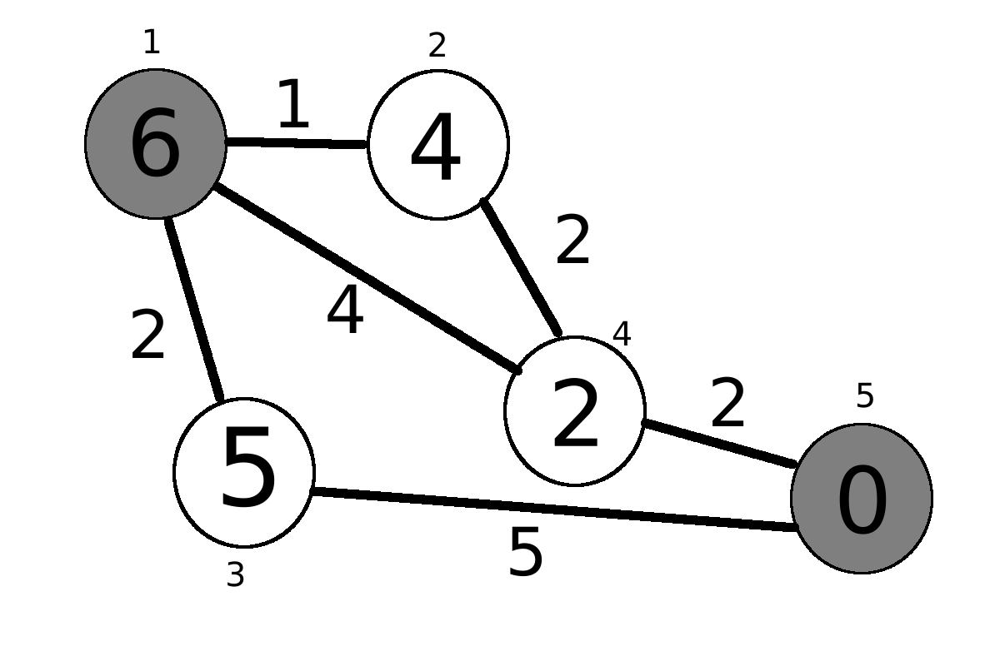

# Pathfinder
Video demo: https://www.youtube.com/watch?v=YGfJPXLM9Jc

This is a pathfinding algorithm written in Python and displayed on the Pygame engine. It uses the A* search algorithm and its goal is to find the shortest distance between any two points, avoiding any obstacles. In the diagram above, the two endpoints are in dark blue, the wall nodes are in black, and the shortest path is shown in light blue with a distance of about 38.63. This algorithm is guaranteed to find the shortest path.

## Table of Contents
* [ Installation ](#installation)
* [ A* search algorithm ](#a-star)
  * [ Explanation ](#explanation)
  * [ How it is used here ](#how-it-is-used-here)

## Installation
First, install pygame by reading the instructions [here](https://www.pygame.org/wiki/GettingStarted).

Once it is installed, cd into the path-finder folder and run pathfinding.py using Python 3. Methods may vary, but here is an example of a command:
> python3 pathfinder.py

## A* search algorithm
Credit to [Wikipedia](*https://en.wikipedia.org/wiki/A*_search_algorithm) for providing the information for the algorithm.

A* is a search algorithm that is used to find the optimal path between two locations. It runs faster than Dijkstra's algorithm, and takes into account two properties to determine the search priority of the nodes: 

* The distance already traveled to reach the current node
* The estimated distance between the current node and the goal node

### Explanation
The A* algorithm uses two sets to keep track of the nodes. The closed set is used to track every node that has already been searched, since there is no use of searching a node twice. The open set is the priority queue of the algorithm, used to determine which nodes are to be searched.

The algorithm has a very specific order to which the nodes should be searched, and this is what seperates A* from many of the other search algorithms. Each node is assigned an *f score*, found using the sum *g(n) + h(n)*. The function *g(n)*  is the distance travelled from the start node, and *h(n)* is a heuristic function, which estimates the distance between the start and goal node. The algorithm searches the node with the lowest f score that is in the open set.

When a node is searched, it is immediately added to the closed set, and each of its neighbors are analyzed. When it encounters a neighbor that is already searched, if the current path is a shorter distance, then the path to the neighbor is rewritten. See the example below:

In this diagram, each node is numbered from 1 to 5 for distinction, with node 1 being the starting node, and node 5 being the goal node. Each node has a number written inside to indicate the distance to the goal node, representing *h(n)*, and each line segment is given a length. At a first glance, it is easy to tell that the path from nodes 1 -> 2 -> 4 -> 5 is the best path, and we travel a total of (1 + 2 + 2) = 5 units.

Initially, the algorithm starts by adding the node 1 ( the starting node) to the open set, and since node 1 is the only node in the open set, it is searched. Once node 1 is searched, it is immediately added to the closed set. Its neigbors, nodes 2, 3, and 4 are analyzed. Scores are given in the following table:

| Node | g(n) | h(n) | f(n) = g(n) + h(n) |
|------|------|------|--------------------|
| 2    | 1    | 4    | 5                  | 
| 3    | 2    | 5    | 7                  | 
| 4    | 4    | 2    | 6                  | 

Since node 2 has the lowest f score (5), it is searched next. The neigbors of node 2 are nodes 1 and 4, however, since node 1 is in the closed set, only node 4 is analyzed. Now we realize that node 4 is given a score of 6 if we start from node 1, however through node 4, we realize the f score is *(1 + 2) + 2 = 5*, which is a better path! This means the original path 1 -> 4 is replaced with the path 1 -> 2 -> 4. Node 2 is then added to the closed set.

Now node 4 has the lowest f score of 5, so it is searched. Then, the goal node is analyzed, so then the program terminates. The optimal path by this algorithm is thus from node 1 to node 2 to node 4 to node 5.

### How it is used here
In the program, each node that is not on the edges or cornes has eight neighbors. For any vertical or horizontal step, the algorithm records it as a distance of 1. For any diagonal step, the distance is recorded as the square root of 2.

For the sake of this program, the heuristic function *h(n)* calculates the shortest possible distance between the current node and the goal node, through horizontal, vertical, and diagonal steps. If *d(n)* is the actual shortest distance between the current node and the goal node, then the inequality *h(n) ≤ d(n)* always holds true.

Here is a proof that this algorithm always yields the shortest path. Consider the final step of the algorithm, where the goal node is searched. Then this must mean that the goal node has the lowest f score, however since the distance between the goal node and itself is zero, *h(n) = 0*, and *f(n) = g(n)*. This means that the f score is precisely the distance between the start node and goal node taking that path. Let this distance be *d*.

Now consider every node in the open set. We know that their f scores must be greater than *d*. Once again, let *d(n)* be the actual shortest distance between the current node and the goal node. Then we have the inequality,

*d ≤ f(n) = g(n) + h(n) ≤ g(n) + d(n)*.

Thus *d ≤ g(n) + d(n)*, and taking that path will yield a distance greater than *d*. Hence the path with distance *d* is the shortest.